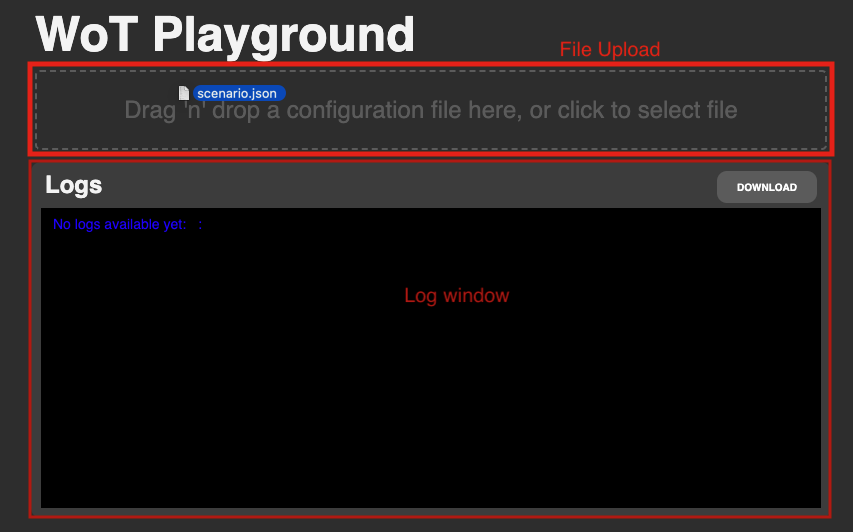

TODO REMOVE: Zoom-Meeting beitreten:

https://tu-berlin.zoom.us/j/68314260453?pwd=bFZkV3VDU0pJd0NXYXVCQlNBNlNGUT09


# Web of Things playground @ IoSL (SNET TU Berlin)

## Table of Contents
- [Introduction/Overview](#introductionoverview)
- [Architecture](#architecture)
- [Install and Run](#install-and-run)
- [User Manual](#user-manual)
  - [Uploading a Configuration file](#uploading-a-configuration-file)
  - [Getting and updating a property of a Thing](#getting-and-updating-a-property)
  - [Calling an action of a Thing](#calling-an-action-of-a-thing)
  - [Interaction between Things](#interaction-between-things)
  - [Executing a playbook](#executing-a-playbook)
  - [Downloading logs](#downloading-logs)
  - [Shutdown Things](#shutdown-things)
- [Local Development](#local-development)
- [Contact Information](#contact-information)
- [Additional Documentation](#additional-documentation)

## Introduction/Overview

[Provide a brief introduction to your project. Describe its purpose, key features, and any relevant background information. Mention what problem your project aims to solve and how it adds value.]

## Architecture

[Explain the overall architecture of your project. Describe the components, modules, or services involved, and how they interact with each other. You can use diagrams or flowcharts to illustrate the architecture if necessary.]


## Install and Run
Due to the dockerization the installation is quite simple. Docker handles all internal insalations and the only prior Requirements are git and docker installed on your system.

### Requirements
- Docker
- Docker compose
- Git

In order to install the playground clone the repository. 

```
git clone https://git.tu-berlin.de/f2499r/web-of-things-playground.git
```
Change the directory
```
cd web-of-things-playground
```
Run the application via docker compose
```
docker-compose up
```
The Docker Images will be initialized and afterwards the the application will be available under the following link:

http://localhost:5173

## User Manual
The following section is intended to explain the functionalities of the Playground and gives
step-by-step instructions on how the application can be utilized in order to simulate Web of Things scenarios.
There are examples and sample files provided for each step.
> **Info:** For the following instructions make sure, that the application is running properly. We recommend to use the docker compose setup.

### Uploading a Configuration file
#### Configuration file
The first step to simulate a Web of THings scenario is to upload a configuration file.
Our application allows to create things locally as well as to access things from the Internet. Both types of Things have to be listed in a single Config file.
The configuration file is a JSON file which consists of two lists. 

The list **"devices"** includes the Things to be created locally. Each Thing has to be an object and requires the properties: **title, description, properties, actions and events**.
When adding multiple local Things make sure to use unique titles to ensure consistency. 

The second list **"externalDevices"** is optional and can be used to add Things from the internet. To add a Thing add a String to the URL endpoint where the Thing exposes its Thing Description. In case you want to add multiple external Devices separate the Strings by comma.

```
{
  "devices": [
    {
      "title": "Thing title",
      "description": "This is a Thing",
      "properties": { 
        ... 
      },
      "actions": {
        ... 
      },
      "events": {
        ...
      }
    }
  ],
  "externalDevices": [
    "http://plugfest.thingweb.io:8083/smart-coffee-machine"
  ]
}
```

An example config file is provided in **examples/scenario.json**
#### Upload the file
The config file can either be uploaded via drag-and-drop to the file upload or by clicking on the File Upload and selecting a file from the filesystem. 



After the config was successfully processed you will see logs on the creation of the devices and the devices will pop up right below the File Upload.
Remote Things can be identified in the logs with the keyword "added", while local Things are "created". Also the Thing representation between the file upload and the log window highlights remote Things as "remote".


### Getting and updating a property
After the Things have been added or created and the Thing representation is visible the user can click on any of the listed devices. 
The Thing representation for the selected device will open up and illustrate all the properties, actions and the events of the Thing.  
Values of properties are automatically retrieved and can be changed by clicking on a selected property field and by typing in the new value. In order to submit the change the user needs to press enter. After pressing enter the Thing representation of the device will close and the logs will display the changes. 
In the logs one can see all the requests which where triggered. This means by clicking on a Thing representation, property logs will be added automatically. In case you want to reduce the number of logs, we suggest to use a playbook, as described below. 

### Calling an action of a Thing
When calling actions there are two types of actions, which are supported by our application: actions without parameters and actions with parameters in the url. Actions with paramerts in the body are currently not supported.
#### Calling actions without parameters
Actions which do not include parameters can be called by opening a Thing representation and clicking on the specific action. Actions without parameters do not have a question mark and will update properties and emit events, depending on the action definition. 
#### Calling actions with uri parameters
Actions with parameters can also be called by opening a Thing representation, but they include a question mark and the url parameters. The user needs to insert the values by editing the prefilled string. To submit the parameterized action call press enter.

An example parameterized action call based on the examples/scenario.json works like described here. Click on the remote Thing: Smart-Coffee-Machine and paste the following text to the makeDrink action field:
```
makeDrink?drinkId=espresso&size=s&quantity=3
```


### Interaction between Things
In addition to interaction between the controller and Things, our application also supports interaction between devices.
The user can open the interaction menu by clicking on the remote on the top right of each Thing representation. After clicking on the remote one needs to select the Thing to send a request to. Select the Thing you want to interact with.

#### Get + Update properties and call actions
Once the user selected a Thing to interact with and the interaction menu is opened, properties and actions are displayed. 
Property and action calls can now be initiated analogous to the approach described above.

#### Subscribing to events
In contrast, to the previously described interaction between controller and Things, it is now possible to subscribe to a specific event.
In the interaction menu one can select an event to subscribe to. After subscribing to the event the Thing will wait until the event has been emitted by the other device. To emit the subscribed event, execute the action of the other Thing that emits it.


### Executing a playbook
In addition to the manual interaction in the Playground, it is also possible to automate the interaction by using a playbook file.
#### Playbook file
The playbook file is a JSON file that has to define a **"steps"** array. Each step is an object, which requires the properties: **"deviceId", "type", "value"**.
The deviceId has to match the title of the Thing from the config file. Then the type can be either "property" or "action". A value is either the name of the property or the action that should be executed.
Parameterized action calls are also possible when providing the name of the action followed by a question mark and the parameters. In case you want to add a timeout, this can be done by adding an object with a **"sleep"** property. The value of the sleep property is the timeout in seconds.

Here is an example based on the examples/scenario.json Configuration file:
```
{
  "steps": [
    {
      "deviceId": "Coffee-machine",
      "type": "property",
      "value": "temperature"
    },
    {
      "deviceId": "Coffee-machine",
      "type": "action",
      "value": "brew_coffee"
    },
    {
      "deviceId": "Smart Fridge",
      "type": "action",
      "value": "make_request?method=GET&url=http://localhost:3000/coffee-machine/properties/temperature"
    },
    {
      "sleep": 5
    }
  ]
}
```
A more detailed playbook file is provided in the examples folder: **examples/playbook_scenario.json**

#### Uploading and executing the playbook file
For uploading and executing use the file upload. After uploading each of the steps of the playbook file will be executed. After the execution is finished you can upload another playbook file.

### Downloading logs
In case one wants to download the logs before shutting down or simulating another scenario, one can download the logs as a text file by clicking on the **"Download"** button on the top right of the log window.

### Shutdown Things
If one wants to simulate another scenario or just shut down the application, one has to click the **"Power"** button on the right next to the file upload. After clicking the button all the Thing containers and the Thing image will be stopped and deleted.
After the shutdown one can either upload another Configuration file or stop the whole application by stopping the docker compose setup.

## API Documentation
The API documentation of the controller is available, when running with docker compose.
URL: http://localhost:5001/api-docs

## Local Development
If you want to run the services locally (without docker-compose) use the commands here: 

Start the backend:
```
cd backend
npm install
npx nodemon
```

Start the frontend:
```
cd frontend
npm install
npm run dev
```

For more detailed descriptions check the README files provided for each service.


## Contact Information

- Marc-Fabio Niemella
  - E-mail: niemella@campus.tu-berlin.de
- Frederic Risling
  - E-mail: f.risling@campus.tu-berlin.de
  - LinkedIn: [Frederic Risling](https://www.linkedin.com/in/frederic-risling-32092b234/)
  - GitHub: [FredericRisling](https://github.com/FredericRisling)
- Oliver Stoll
  - E-mail: 
  - Opt. LinkedIn
  - Opt. GitHub


## Additional Documentation

[If there are additional documents or resources related to your project, list them here with brief descriptions and links.]


