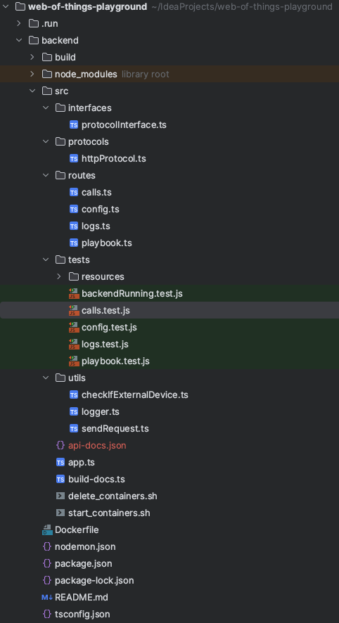

# Web of Things Controller
The Web of Things Controller manages the interaction from User to Things as well as from Thing to Thing. It collects the information from the playground simulation and makes it available as a single point of contact. Thus, it serves as an interface between the frontend and Things in the context of the Web of Things playground. The controller provides a REST API that is used to interact with the frontend. For communication with the devices, it currently supports HTTP, but has been designed to be extensible for other protocols. In addition to communicating with Things, the controller also handles the creation of local Things and the connection of remote devices from the Internet.
## Table of Contents
- [Implementation](#implementation)
  - [Technology Stack](#technology-stack)
  - [Structure of the project](#structure-of-the-project)
- [Extensibility and Docker features](#description-of-extensibility-and-docker-features)
  - [Extensibility - Send and Receive](#extensibility---send-and-receive)
    - [How to add more protocols](#how-to-add-more-protocols)
  - [Dockerized](#dockerized)
    - [Dockerization of Controller](#dockerization-of-controller)
    - [Creating the Thing image and containers](#creating-thing-image-and-containers)
- [Installation and Running instructions](#installation-and-running-instructions)
  - [Requirements](#Requirements)
  - [Installation command](#installation-commands)
  - [Running commands](#running-commands)
- [Running the tests](#running-the-tests)
- [API documentation](#api-documentation)
- [Known issues](#known-issues)


## Implementation
For the implementation of the controller as a backend server, which is supposed to communicate with the frontend as well as with Things in the context of the Playground, different aspects had to be considered. On the one hand, enabling HTTP REST API communication with the frontend as well as interaction with Things. Things in the sense of the Web of Things specification can support different protocols, which means that the backend must also be able to support different protocols. Therefore, great emphasis was given to extensibility and the use of industry standards for the implementation of the controller.
### Technology Stack
The controller uses a technology stack that was selected based on established de-facto IoT standards.
- **Node.js**: Node.js is used as a runtime environment for the code as it supports JavaScript. Additionally, it allows to use asynchronous communication, which is often used in the IoT context in the form of events. 
- **TypeScript**: We use Typescript as our programming language, which extends the JavaScript syntax with static typing, enabling improved code quality and maintainability.
- **Express**: We use Express as the overlying framework, as it provides a convenient syntax to implement REST APIs and can also support extensibility with respect to other protocols.
- **Docker**: As the container technology we use Docker, as it is the de-facto industry standard even beyond IoT. It is used by the backend to create containerized Things.
- **Bash**: Bash is used to execute Docker commands on the host machine.

### Structure of the project
The express server is structured as follows:




The source code for the backend server is located in the **src** folder.
The entrypoint for the server is the **app.ts** file, which imports the modules. Modules are structured into interfaces, protocols, routes, tests and utils.
Routers handle requests for a specific endpoint. Calls.ts handles requests from the frontend to send a request to a Thing. Uploading a config is done via the config.ts route, while logs.ts provides an endpoint for Things to send logs to the controller.
The playbook.ts router handles the uploading of playbook files. Tests, which test the main functionalities of the routes are located in the **tests** folder.
There are two bash scripts located in the src folder. They are utilized by the config route to start and delete Docker containers from the host system.
In addition to the source code in the src folder there is a Dockerfile for building the image of the controller and node specific configuration files.


## Description of extensibility and Docker features
Two of the main design goals of this Controller are extensibility and utilizing of containerization.
Therefore, a description on implementation details for these two aspects is provided here.
### Extensibility - Send and Receive
In the context of this project, extensibility includes code quality, maintainability, but also a modular design of the code components to enable easy addition of other IoT protocols in addition to HTTP.
Accordingly, the express app has an interface for protocols: protocolInterface.ts. In order to implement the interface it is required to implement three functions:
- **connect**: Implements how to connect to the protocol. 
- **receive**: Implement how to receive data via the protocol.
- **send**: Implement how to send data via the protocol.

Currently, the httpProtocol.ts module serves as an example on how to implement the interface for HTTP.

#### How to add more protocols
If your use-case requires adding another protocol, this section describes how to do it.
1. Implement the protocolInterface.ts interface for the desired protocol
2. Add the handling of requests for the corresponding protocol in the sendRequest.ts util module.
### Dockerized
The Contoller itself can be started as a Docker container using the Dockerfile provided.
Additionally, the Things, which are created from the Controller are also dockerized.
Whereas the Things can only be created as Docker images it is possible to start the Controller without Docker, as described below.
#### Dockerization of Controller
The Dockerfile of the controller does not only containerize the source code for the backend but also stores the source code of the things, because the image of the things is built by the controller and also the start of the thing container is done by the controller. Therefore, the build context must be the parent directory of the backend folder. The Docker compose file in the web-of-things-playground folder uses the custom build context. The API documentation is automatically generated when building the controller image.
#### Creating Thing image and containers
Building the Thing image and starting the Thing containers is done in the Controller regardless of whether the controller is running in Docker or on the host.
The bash script start_containers.sh is used for this purpose. This script is executed after a configuration file has been uploaded via the config.ts route. This script then builds the Thing image and starts the number of Things needed depending on the configuration file.
If the Controller is started in Docker, it is mandatory that the Docker socket of the container is overwritten with the Docker socket of the host machine. This is done by mounting the Docker socket for the backend image as a volume. The mounting for the backend is done in the Docker compose file of the parent directory.

## Installation and Running instructions

### Requirements
- Docker (tested with 20.2.0, Docker as root user)
- jq installed on command line (tested with 1.6)
- Node (tested with 20.2.0)
- npm (tested with 9.6.6)
### Installation commands
> **Info:** Assuming that you cloned the web-of-things-playground and current directory is web-of-things-playground

```
cd backend
npm install
cd src
npx ts-node build-docs.ts
cd ..
```


### Running commands
```
cd backend
npx nodemon
```

npx nodemon will run the backend server in development mode. So on every change and save in the repository the backend server will restart.


## Running the tests
In order to run the test make sure that the backend is running.
```
cd backend
npx jest
```

## API documentation
An API documentation is available under: http://localhost:5001/api-docs

## Known issues
- **Logging for external Devices**:
With the current architecture the logging of external devices is implemented separately to the logging approach of internal devices. Internal devices send a log to the express server, whereas external devices do not. 
Currently, the logging of external devices is done after a response was sent by the Thing and the log is parsed from the response value. 
- **Security issues by using a mounted Docker socket**:
From a security perspective, it cannot be considered a best practice to launch additional Docker containers on the host from a Docker container by attaching the Docker socket to the container. The container gains privileged rights and therefore lacks of security. 
