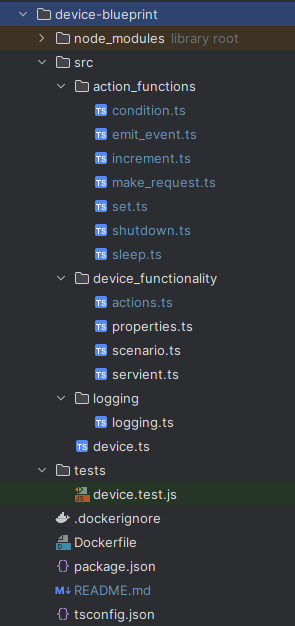

# Web of Things Device Blueprint
The Device Blueprint is the center-piece of the Web of Things playground, simulating (multiple) IoT devices. 
It is configurable through a configuration file that is similar but not equal in it's structure to a Thing Description. 
Within this configuration file, users can specify details about a device that should be simulated, such as properties, actions and their internal behaviour and events. 
These details are then used to create a node.js application that simulates the device and exposes it's properties and actions through a REST API.
For this purpose, the node-wot framework is used, which helps with the implementation of the Web of Things standard.
Devices also log all their interactions to the backend controller, so that the user of the playground can understand and comprehend them.
Users can specify multiple devices in the configuration file, which are then simulated in parallel, by creating multiple containers from the same image.
For communication protocols, HTTP is currently supported, but has been designed to be extensible for other protocols. 

## Table of Contents
- [Implementation](#implementation)
    - [Technology Stack](#technology-stack)
    - [Structure of the project](#structure-of-the-project)
- [Extensibility](#extensibility)
    - [Action Types](#extensibility---send-and-receive)
    - [Protocols](#dockerized)
- [Installation and Running instructions](#installation-and-running-instructions)
    - [Requirements](#requirements)
    - [Installation](#installation)
    - [Run a Device](#run-device)
    - [Running the tests](#run-tests)
- [Known issues](#known-issues)


## Implementation

### Technology Stack
The devices use a technology stack that was selected based on established de-facto IoT standards.
- **Node.js**: Node.js is used as a runtime environment for the code as it supports JavaScript. Additionally, it allows to use asynchronous communication, which is often used in the IoT context in the form of events.
- **Docker**: As the container technology we use Docker, as it is the de-facto industry standard even beyond IoT. It is used to create containerized Things, that can be run as multiple containers.
- **TypeScript**: We use Typescript as our programming language, which extends the JavaScript syntax with static typing, enabling improved code quality and maintainability.

### Structure of the project
The Device Blueprint is structured as follows:




The source code is located in the **src** folder.
The entrypoint for the server is the **device.ts** file, which imports the modules. Here, all configured actions, properties and events get handlers assigned.
These handlers vary in complexity, with actions being the most complex, as they can be configured to have a specific behaviour.
All supported action types are located in their own file in the **action_functions** folder, with the general handling of an action call being located in the **device_functionality/action.ts** file.
Other functionality such as parsing the configuration file, creating the node-wot thing and initializing properties is also located in the **device_functionality** folder.
Logging is handled in the **logging** folder, with the **logging.ts** file.
Tests, which test the main availability of the routes, especially for correct initialization, format of configuration & networking are located in the **tests** folder.
In addition to the source code in the src folder there is a Dockerfile for building the image of the controller and node specific configuration files.


## Extensibility
One of the main design goals of the Devices was extensibility.
Therefore, a description on implementation details is provided here.
### Extensibility - Action Types
In the context of the Device Blueprint, actions are the most complex & configurable part of the implementation.
Users can choose between different action types, which are implemented in the **action_functions** folder.
Currently, the following action types are supported:
- **Set**: The set action type is used to set a property to a specific value.
- **Increment**: The increment action type is used to increment a property by a specific value.
- **Emit_event**: The emit_event action type is used to emit an event with a specific payload.
- **Sleep**: The sleep action type is used to pause the execution of the action for a specific amount of time.
- **Condition**: The condition action type is used to execute an action based on a condition. The condition is specified in the configuration file.
- **Make_request**: The make_request action type is used to send a request to a specific URL. This is a special action used to control devices from the backend.
- **Shutdown**: The shut_down action type is used to shut down the device. This is a special action used to power-down devices from the backend.

#### How to add more Action Type functions
If your use-case requires adding more action types, this section describes how to do it.
1. Implement the action type in the **action_functions** folder. 
The action type should be implemented as a function that takes the **ExecuteActionData** object as an argument.
This object contains all the information that is needed to execute the action, including :
    - **action**: The action that is being executed (required).
    - **property**: The property that is being affected by the action.
    - **properties_dict**: A dictionary containing all properties of the device, for easy access.
    - **variables**: Uri variables that are passed by the user when calling the action.
    - **thing**: The node-wot thing that is used to expose the device.
2. Add the action type function to the **execute_action_functions** dictionary in the **action.ts** file.
3. Now you can use the action type in the configuration file.

## Installation and Running instructions


### Requirements
- Docker *(tested with 20.2.0)*
- Node *(tested with 18.16.0)*
- npm *(tested with 9.6.6)*

> **Info:** Assuming a freshly cloned project and working-directory: *web-of-things-playground/device-blueprint*


### Installation

```
npm install
```


### Run Device
```
docker build -t wot-device . 
docker run -p 3010:3010 -e DEVICE_IDX=0 -e PORT=3010 wot-device
```
Notice that for this run command, no external configuration file is passed to the device. 
Instead, the *scenario_backup.json* file is used as a default configuration file.
The DEVICE_IDX environment variable is used to specify the index of the device in the configuration file.
The PORT environment variable is used to specify the port on which the device is exposed.


### Run Tests
In order to run the test, one can simply run jest to execute all device tests:
```
jest
```
Tests are designed to run for the devices specified in the *scenario_backup.json* file. 
This way, single device containers can be run without any additional configuration or interaction with the backend.


## Known Limitations
- The Node-WoT framework internally does not expose the actual endpoint request, but instead only property-/action-/event-handlers.
This means that aspects of the request such as the headers cannot be accessed.
- 'host.docker.internal' is used as the hostname for the backend controller, which use varies slightly between operating systems.
- Aspects of the configuration file are not validated, such as the action type or the action payload (for example event names to emit).
- make_request action type is currently only supported for HTTP requests.