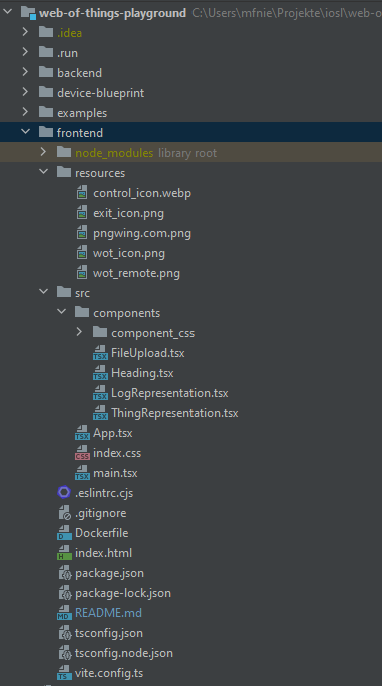

# Web of Things User Interface

The frontend hosts our Web of Things Playground user interface. It manages all the user interactions and works as the entry point for the application. There is no direct communication
between the frontend and the specific Things, the whole communication is running over the
backend controller via REST API. The frontend handles the upload of configuration and playbook files, parses the Thing Descriptions to visualize the devices, and enables a visualized
interaction with them.


## Table of Contents
- [Implementation](#implementation)
    - [Technology Stack](#technology-stack)
    - [Structure of the project](#structure-of-the-project)
- [Installation and Running instructions](#installation-and-running-instructions)
    - [Requirements](#Requirements)
    - [Installation command](#installation-commands)
    - [Running commands](#running-commands)
- [Known issues](#known-issues)

## Implementation
The frontend user interface is implemented as a React based single-page web application and
written in Typescript. Since it is only communicating with the controller and not with the
devices directly, there is no need for different protocols here. The communication is completely
based on our HTTP REST API. But because we extract the endpoints for the interactions with
the devices from the Thing Descriptions here, we could not ignore the extensible of the frontend
completely. As with the rest of our application, we limited our current implementation to Http,
but everything is build to make an extansion as easy as possible.

### Technology Stack
The frontend uses a technology stack that was selected based on established industry standards.
- **Node.js**: Node.js is used as a runtime environment for the code as it supports JavaScript. Additionally, it allows to use asynchronous communication, which is often used in the IoT context in the form of events.
- **TypeScript**: We use Typescript as our programming language, which extends the JavaScript syntax with static typing, enabling improved code quality and maintainability.
- **React**: We use React as the overlying framework, as it is one of the most used web developing frameworks and de-facto industry standard.

### Structure of the project
Our React frontend is structured as follows:



The source code for the frontend is located in the **src** folder.
The main application is the app.tsx file, which imports all the components. The used components are in the **src/components** folder. The application is based on four different components.
The FileUpload component handles the upload of the configuration and playbook file and executes a first simple validation check.
The Heading component is quite simple only displays the heading of the app.
The LogRepresentation component is responsible for fetching the logs from the backend and displaying all the interactions.
And the most important component is the ThingRepresentation, which is responsible for parsing the Thing Descriptions, displaying the devices and enablling the interactions with them. The corresponding css-files can be found in the **src/components/component_css** folder.


## Installation and Running instructions
The forntend can also be started without Docker for local development. The following pack-
ages are required to be installed on your machine.

### Requirements
- Node (tested with 20.2.0)
- npm (tested with 9.6.6)

### Installation commands
> **Info:** Assuming that the main git repository has been cloned one can install the fronted with the
following commands:

```
cd frontend
npm install
```


### Running commands
To run the frontend use these commands:

```
cd frontend
npm run dev
```


While running the frontend is available under:

Local: http://localhost:5173/

Network: http://192.168.178.128:5173/

## Known issues

Caused by the timeframe of this project our current frontend implementation has some small
limitations. In this part we want to look trough them and how they could effect our application.


- **Error Handling**:
The error handling might not be sufficient in every case. Currently we are checking user input in form of uploaded files and text input for the correct type, but there is no proper valiation. For example, files are checked for a correct json syntax and if they are a configuration
or playbook file, but it is not checked in detail, if the content is in line with our requirements.
This could end up in errors and crashes if mandatory fields are missing.
- **Extensibility:**
A big focus of our application was the extensible. Even though the frontend is only communicating with the backend, we can not ignore the extensible completely. Currently, the implementation only supports devices communicating in http and with no, or a basic in-header
security definition. To implement other protocols and security definitions, several changes
have to be done. The specific places have been highlighted with toDos directly in the code.
- **Parameter:**
The WoT standard allows parameter for getting properties and calling actions. In
our current implementation we only have limited support for parameterized actions. Actions
can be called with variables in the URL of a request, but we don’t enforce a correct input.
Actions with input variables in the body, or parameterized property calls are currently not
supported.


